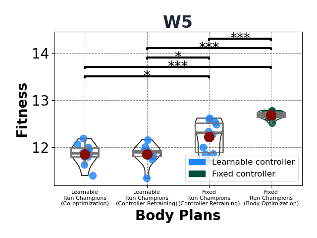

# Investigating the hardship of brain-body co-optimization

This is the code for the paper [Investigating Premature Convergence in Co-optimization of Morphology and Control in Evolved Virtual Soft Robots](https://link.springer.com/chapter/10.1007/978-3-031-56957-9_3) ([arxiv](https://arxiv.org/abs/2402.09231))

## Very (very) short summary

During co-optimization, brains become too specialized for particular bodies and don't transfer well to others, resulting in poor search over the morphology space. We demonstrated this by showing that not having to optimize a brain -- fixed controller case, achieves significantly better performance.

<div align='center'>
</img>
</div>

## Citation
If you find this work useful, please consider citing:

```text
@InProceedings{10.1007/978-3-031-56957-9_3,
author="Mertan, Alican
and Cheney, Nick",
editor="Giacobini, Mario
and Xue, Bing
and Manzoni, Luca",
title="Investigating Premature Convergence in Co-optimization of Morphology and Control in Evolved Virtual Soft Robots",
booktitle="Genetic Programming",
year="2024",
publisher="Springer Nature Switzerland",
address="Cham",
pages="38--55",
abstract="Evolving virtual creatures is a field with a rich history and recently it has been getting more attention, especially in the soft robotics domain. The compliance of soft materials endows soft robots with complex behavior, but it also makes their design process unintuitive and in need of automated design. Despite the great interest, evolved virtual soft robots lack the complexity, and co-optimization of morphology and control remains a challenging problem. Prior work identifies and investigates a major issue with the co-optimization process -- fragile co-adaptation of brain and body resulting in premature convergence of morphology. In this work, we expand the investigation of this phenomenon by comparing learnable controllers with proprioceptive observations and fixed controllers without any observations, whereas in the latter case, we only have the optimization of the morphology. Our experiments in two morphology spaces and two environments that vary in complexity show, concrete examples of the existence of high-performing regions in the morphology space that are not able to be discovered during the co-optimization of the morphology and control, yet exist and are easily findable when optimizing morphologies alone. Thus this work clearly demonstrates and characterizes the challenges of optimizing morphology during co-optimization. Based on these results, we propose a new body-centric framework to think about the co-optimization problem which helps us understand the issue from a search perspective. We hope the insights we share with this work attract more attention to the problem and help us to enable efficient brain-body co-optimization.",
isbn="978-3-031-56957-9"
}
```
